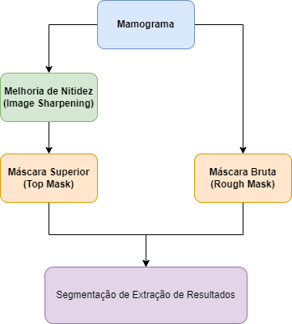
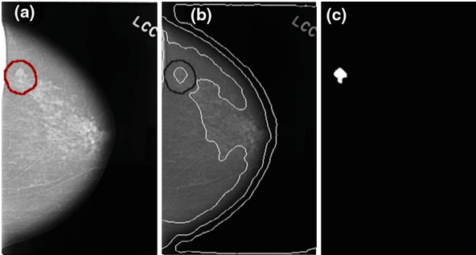
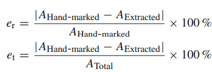

# Proposta do artigo:
Propor um algoritimo para identificar de forma eficiente o cancer de mama com base em mamografias, utilizando segmentação de textura.
Base de Dados de teste: digital database for screening mammography for cancer research and diagnosis:
<https://wiki.cancerimagingarchive.net/display/Public/CBIS-DDSM#:~:text=This%20CBIS%2DDDSM%20(Curated%20Breast,cases%20with%20verified%20pathology%20informat>

## Motivação: 
A mamografia é um excelente meio para gerar as imagens mas o processamento possui inclinação a erros humanos, uma vez que 
um alto volume de dados precisa ser processado por mão de obra insuficiente.

## Fluxo de Processamento Geral:

O artigo descreve os diversos processos para criação de cada amostra das etapas que compoem o diagrama geral. A idéia principal é conseguir uma amostra de imgem capaz de falicitar a extração da imagem original, das possíveis massas que indicariam o cancer.

# Testes e Resultados:

A imagem a seguir mostra os tres estágios do processamento da imagem:

**a**. Mostra a imagem da mamografia original. **b**. Mostra a imagem segmentada, trazendo as regioes de interece em contorno **c**. Mostra a extração das regioes de contorno, com base em um limite definido.

## Validação

Para poder validar as extrações geradas, as imagens foram testadas, comparando as regiões extraidas pelo algorítimo com as regiões extraidas a mão.

Através da razão da diferença entre o calculado e o previsto com o total da imagem pode-se obter uma estimativa de erro. O mesmo pode ser feito com a razão em relação a região marcada manualmente:

Ambas as equações servem como medida de eficiência do algorítimo. 

Os dois parâmetros que podem influênciar o resultado do processamento, tornando-o mais ou menos eficiente, são:

- Valor Cinza: valor numérico que representa uma escala limitante de cinza para considerar no processamento e criação das bordas.P
- Tamanho do Limiar de Referência de Massas "pequenas": Valor para refrência do descarte de massas identificadas que podem ser ignoradas.

Apresentar um artigo de processmento digital de imagens, e montar um fluxograma do processamento que a imagem sofre
